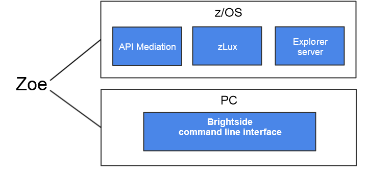

# Installing Project Zoe

Project Zoe consists of three main components: zLUX, the explorer server, and the Brightside CLI. You install zLUX and the explorer server on z/OS and install Brightside CLI on PC. The installations on z/OS and on PC are independent.

To get started with installing Project Zoe, review the [Installation roadmap](installroadmap.md) topic.
